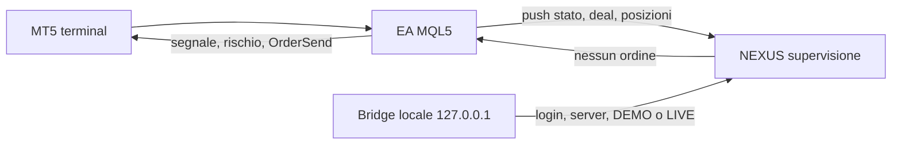

# Trading: un solo motore, l'EA

L'EA MQL5 (`MQL5/Experts/NEXUS_EA_v2.mq5`) è l'unico componente che legge il mercato, genera il segnale e chiama `OrderSend` (`NXS_OpenTrade` in `NXS_Execution.mqh`, invio in `NXS_Globals.mqh`). NEXUS non ha un secondo motore.



Il Python in `server/trading_v1/` registra ciò che l'EA ha già fatto, riconcilia ordini, deal e posizioni, e decide solo se il conto risulta verificato. Non sceglie la direzione e non invia.

Un timeout dell'EA non è un ordine fallito. Prima di qualunque nuovo tentativo si confronta `client_id` con ordini, deal e posizioni. Se l'esito non è una conferma, lo stato resta `AMBIGUOUS` e `retry_allowed` resta falso.

DEMO non risulta verificato finché il bridge non vede un conto demo collegato e una persona non conferma quel login. LIVE resta disabilitato. La stringa `ENABLE_LIVE` da sola non basta: servono identità del terminale, login specifico, limiti dentro la policy e un'approvazione con `approval_id`. Anche quando tutto è presente, `live_enabled` resta falso.

## Collegare il terminale

Sul PC dove gira MT5, non sul server Render:

1. Genera il token del backend e tienilo fuori da git. Minimo 24 caratteri.
2. Installa il pacchetto `MetaTrader5` in quel Python, con il terminale aperto sul conto.
3. Avvia solo in loopback:

```bash
python LocalBridge/nexus_mt5_readonly_bridge.py
```

Il processo ascolta `127.0.0.1` e risponde a `GET /v1/mt5/account` con header `X-Nexus-Token`. Un `POST` riceve 405. Non va esposto su internet e non va deployato.

L'EA continua a mandare lo stato con `InpEnableWebSync` verso `/api/ea/push`, come già fa. Questo branch non accende il demo e non manda ordini.
