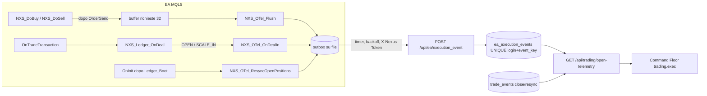

# Telemetria delle aperture MT5 (NEXUS-OTEL-001)

Percorso: EA → OrderSend → conferma broker → evento apertura → backend NEXUS → proiezione → Command Floor.

L'EA resta l'unico motore che invia ordini. Questo cambio aggiunge solo osservazione: l'EA accoda eventi, il backend li salva una volta e li proietta. Nessuna funzione Python invia, ritenta o modifica ordini.

Stato compilazione MQL5: **NOT_COMPILED**. Questo ambiente non ha MetaEditor.

## Architettura

Nel percorso d'ordine non c'è rete. `NXS_DoBuy`/`NXS_DoSell` scrivono in un buffer in memoria; timer e `OnTradeTransaction` lo svuotano nell'outbox, che è già il canale durevole usato per le chiusure (file, backoff 5→300 s, 8 tentativi, 409 e 200 considerati consegnati). Nel Strategy Tester non si accoda nulla.

## Eventi

| Evento | Quando | Chiave di idempotenza | Dati |
|---|---|---|---|
| `order_result` | ogni tentativo di apertura, anche rifiutato o bloccato prima dell'invio | `ord:<order>` se il broker ha assegnato un ticket, altrimenti `req:<sent_at>:<microsecondi>` | simbolo, lato, magic, strategia, volume e prezzo richiesti, SL/TP, retcode, order, deal, volume e prezzo eseguiti, motivo del blocco |
| `deal_in` | ogni deal IN che il ledger dell'EA classifica `OPEN` o `SCALE_IN` (i duplicati sono già scartati dal ledger) | `deal:<deal>` | deal, order, position_id, volume e prezzo del deal, `DEAL_TIME_MSC`, strategia (da intent, altrimenti dal commento, con provenienza), posizione vista dal terminale sì/no, volume, prezzo, SL/TP della posizione |
| `position_snapshot` | al boot, per ogni posizione Nexus viva | `snap:<position>:<volume in centesimi>` | stato della posizione visto dal terminale in quel momento |

Ogni evento porta anche `account_login`, `account_mode` (DEMO/LIVE/…), `ea_magic`, `ea_version`, `emitted_at`.

## Stati di un tentativo

| Stato | Condizione |
|---|---|
| `REQUEST_BLOCKED` | bloccato dall'EA prima di `OrderSend` (oggi: gate conto ACCT-001) |
| `REQUEST_REJECTED` | inviato, retcode diverso da PLACED/DONE/DONE_PARTIAL, oppure nessun ticket |
| `ORDER_ACCEPTED` | ticket assegnato, nessun deal ancora |
| `ACCEPTED_NO_FILL` | accettato da oltre 120 s senza deal: ambiguo, da riconciliare. Nessun nuovo tentativo |
| `PARTIALLY_FILLED` | volume dei deal inferiore al richiesto |
| `DEAL_EXECUTED` | deal presente ma il terminale non vedeva la posizione al momento del deal |
| `POSITION_OPEN` | deal IN presente **e** posizione vista dal terminale (deal o snapshot di boot) |
| `CLOSED` | la chiusura della posizione è nel ledger `trade_events` |

Un'apertura non viene mai dichiarata prima di un deal MT5 e di una posizione vista dal terminale. `retry_allowed` è sempre `false`.

## Casi gestiti

- **Fill parziali.** `DONE_PARTIAL` ora conta come apertura riuscita in `NXS_DoBuy`/`NXS_DoSell`. Prima veniva trattato come fallimento e lasciava una posizione viva senza intent né Virtual SL. Il volume reale è la somma dei deal IN dell'ordine. Limite: l'intent registra il rischio sul volume pianificato, quindi su un fill parziale la R risulta prudente (rischio sovrastimato).
- **Netting.** L'EA rifiuta l'avvio su conti non hedging (`AUD0-LEDGER-007`). La proiezione usa `position_id` come chiave, quindi due posizioni sullo stesso simbolo restano distinte.
- **Retry.** `NXS_SafeBuy`/`NXS_SafeSell` ritentano solo REQUOTE, PRICE_CHANGED, PRICE_OFF e 10022: sono rifiuti, nessun ordine creato. Ogni tentativo è un `order_result` separato; solo quello accettato porta il ticket. NEXUS non ritenta mai.
- **Duplicati.** Lato EA il ledger scarta i deal ripetuti. Lato backend `UNIQUE(account_login, event_key)` su SQLite, quindi persiste ai riavvii; il replay dell'outbox riceve `200 duplicate=true`.
- **Crash o disconnessione.** L'outbox è su file e sopravvive al riavvio del terminale. Al boot ogni posizione viva viene dichiarata con `position_snapshot`, così un `deal_in` perso è coperto dal fatto osservato. Una posizione senza `order_result` corrispondente compare in `unreported_orders`. Le chiusure avvenute offline restano gestite dal ledger esistente e dalla history sync.
- **Payload non valido.** 422, che l'outbox tratta come errore permanente e scarta senza ritentare.

## Accesso

- `POST /api/ea/execution_event`: `X-Nexus-Token` obbligatorio, corpo massimo 16 KB, schema chiuso (tipo, formato chiave, interi non negativi, booleani veri).
- `GET /api/trading/open-telemetry`: sessione utente obbligatoria. Filtro opzionale `account_login`, limite massimo 5000 eventi.
- Nessuna credenziale nei payload: login, server e magic sono identificativi, non segreti.

## Procedura di prova DEMO

Da eseguire solo con autorizzazione esplicita, sul PC con MT5, su un conto **DEMO**. In questa task non è stato inviato nessun ordine.

1. Compilare l'EA con `handle_compile_ea` del worker locale. Esito atteso: 0 errori. Annotare il numero di warning.
2. Rigenerare il manifest di deploy se la build va distribuita.
3. Agganciare l'EA a un grafico del conto DEMO con `InpEnableWebSync=true`, URL del backend nella allow-list WebRequest, `InpLiveTradingAuthorized=false`.
4. Nel log verificare `[NEXUS ACCOUNT] ... mode=DEMO new_entries=ALLOWED`.
5. Attendere un segnale reale della strategia configurata. Non forzare ordini manuali: un ordine manuale non ha magic Nexus e non viene tracciato.
6. Entro pochi secondi dall'apertura, `GET /api/trading/open-telemetry?account_login=<login>` deve mostrare:
   - un `order_result` con `retcode` 10009 e `order` uguale al ticket nel Journal MT5;
   - un `deal_in` con `deal` e `position_id` uguali a quelli della scheda Storico;
   - lo stato `POSITION_OPEN`, `confirmed_by: deal+terminal`, SL e TP uguali a quelli del terminale.
7. Riavvio: chiudere MT5 con la posizione aperta, riaprirlo. Atteso un `position_snapshot` con la stessa posizione e nessuna riga duplicata per `deal:` o `ord:`.
8. Disconnessione: bloccare la rete del PC per 1–2 minuti durante un segnale, poi riattivarla. Atteso: eventi consegnati dall'outbox dopo il ritorno della rete, `outboxPending` nel push torna a 0.
9. Chiusura: quando la posizione si chiude (SL, TP o protezione), lo stato del tentativo diventa `CLOSED`.
10. Conto reale senza autorizzazione (facoltativo, nessun rischio): atteso `new_entries=BLOCKED` e, al primo segnale, un `order_result` con `sent=false` e stato `REQUEST_BLOCKED`.

Esito della prova: annotare ticket, deal, posizione e stato osservato in ogni passo. Senza questa prova la telemetria resta **non verificata su MT5**.

## Test automatici

`server/tests/test_trading_open_telemetry.py`:

- statici sull'EA: punto di registrazione in `NXS_DoBuy`/`NXS_DoSell`, nessun `OrderSend`/`WebRequest` nel modulo, hook in `OnTradeTransaction`, `OnTimer`, `OnInit`;
- proiezione: ciclo completo, accettato senza deal e ambiguo dopo 120 s, deal senza posizione, fill parziale e completamento, tentativi rifiutati separati, blocco locale, recupero da snapshot dopo crash, chiusura riconciliata, due posizioni hedging;
- validazione: 10 payload malformati rifiutati;
- idempotenza persistente su file SQLite riaperto;
- API: token obbligatorio per scrivere, sessione per leggere, duplicato 200, payload invalido 422, migrazione `017_execution_events`.
