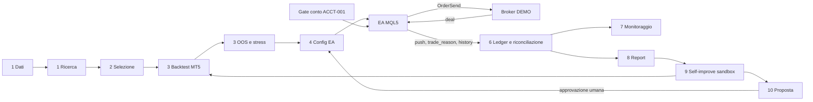

# Trading: copertura del workflow e primo blocco chiuso

Data: 2026-10-10. Base: `main` @ `8d74193`. Confronto con `feature/trading-execution-v1` @ `c9e3455` (2 commit avanti a main, non mergiato).

Vincolo: `MQL5/Experts/NEXUS_EA_v2.mq5` è l'unico motore che genera segnali, applica il rischio e chiama `OrderSend`. Python registra, riconcilia, riporta e propone. Non invia.

## Legenda

| Stato | Significato |
|---|---|
| MISSING | Non esiste codice che faccia questa cosa |
| IMPLEMENTED | Il codice c'è |
| TESTED | Ha test automatici che passano in CI (`server/tests`, 1132 passed su questo branch) |
| CONNECTED | È raggiungibile dal workflow reale: un endpoint, un push dell'EA o una stazione del Floor lo usa |
| VERIFIED_OPERATIONAL | Esiste una prova su MT5 reale (compilazione, Strategy Tester o conto DEMO) riproducibile da questo repo |

Nessuno step è VERIFIED_OPERATIONAL da qui: questo ambiente non ha MetaEditor né un terminale MT5. Le prove MT5 citate nel repo (es. il conto demo nominato in `NXS_Inputs.mqh`, i certificati in `results/`) sono storiche e non rieseguibili da CI.

## Matrice dei 10 step

| # | Step | Codice reale | Ingresso nel workflow | Stato | Primo blocco concreto |
|---|---|---|---|---|---|
| 1 | Dati di mercato e ricerca | `server/dukascopy_fetch.py`, `server/mt5_data_v1/*`, `server/market_read_model.py`, `server/research_control_plane.py`, EA export `MQL5/Experts/NXS_Export*.mq5` | `/api/dukascopy_status`, `/api/market/*`, `/api/research/control-plane/*`; stazioni Floor `trading.data`, `trading.research` | CONNECTED (read-only) | Il read model espone artefatti già prodotti; nessun job pianificato rinnova i dati e la ricerca da solo |
| 2 | Selezione e validazione strategie | `server/strategy_registry.py`, `strategy_census_read_model.py`, `strategy_pipeline_read_model.py`, `NXS_StrategyRegistry.mqh`, `NXS_LockedProfile.mqh` | `/api/company/strategy-census`, `/api/strategies/registry`, `/api/backtest/locked_profile` → EA `GET /api/ea/locked_profile` | CONNECTED | La validazione indipendente (`trading.valid`, gate `approval`) è solo una stazione del Floor: nessun record di review lega una strategia alla sua promozione |
| 3 | Backtest, OOS, stress | `server/backtest.py` (re-implementazione Python, fallback sintetico se la rete manca), `server/bt_verdict.py` (CSV reali MT5), `NXS_TestValidityCertificate.mqh`, `/api/research/certificates/*`, `/api/research/control-plane/forward-validation` | `/api/backtest/*`, `/api/backtest/import_results` | TESTED (Python), manuale (MT5) | Il Strategy Tester dell'EA vero si lancia a mano: `LocalBridge/nexus_local_worker.py` ha `compile_ea`, `deploy_files`, `restart_mt5` ma nessun `run_tester`. OOS e stress sul motore reale non sono automatizzabili |
| 4 | Preparazione e configurazione EA | `NXS_RuntimeSettings.mqh`, `server/settings_contract.py`, `settings_schema.py`, `NXS_Presets.mqh`, `MQL5/Demo/*.set`, worker `compile_ea`/`deploy_files` | `GET /api/ea/settings` + `ack`, `PUT /api/settings` (cap di rischio con `nexus_policy.enforce_cap`) | CONNECTED | Compilazione e deploy esistono solo sul worker locale; nessuna prova di compilazione in CI |
| 5 | Esecuzione su DEMO MT5 | EA: `NXS_OpenTrade` → `NXS_CommonExposurePreflight` → `NXS_DoBuy/DoSell` (`NXS_Globals.mqh`) | L'EA stesso | IMPLEMENTED, non verificato da qui | **Chiuso in questo branch (blocco #1)**: prima l'EA apriva su qualunque conto, LIVE compreso. Nessun gate leggeva il tipo di conto |
| 6 | Rischio e riconciliazione | EA: `NXS_RiskShield.mqh`, `NXS_Protections.mqh`, `NXS_Risk.mqh`, ledger `NXS_TradeLedger.mqh`, `NXS_HistorySync.mqh`, `NXS_Outbox.mqh`. Backend: `trade_events` append-only con hash a catena | `/api/ea/trade_reason` (`close`/`resync`), `/api/ea/trade_history_sync` | CONNECTED, TESTED (backend) | L'EA non emette mai l'evento `open` (il backend lo accetta). Il supervisore `trading_v1` con la riconciliazione di timeout esiste solo su `feature/trading-execution-v1` e non riceve nulla: `TradingSupervisor.ingest` è chiamato solo dai test |
| 7 | Monitoraggio posizioni | EA `/api/ea/push` ogni ciclo (posizioni, equity, protezioni), `ea_status_history`, `execution_read_model.py` | `/api/ea/status`, `/api/ea/health`, `/api/ea/history`, Floor | CONNECTED, TESTED | Fino a questo branch il push non diceva su che conto girava l'EA (login, server, DEMO/LIVE) |
| 8 | Report automatici | `ledger_analytics.py`, `/api/analytics/*`, `NXS_Notify.mqh` (riepilogo giornaliero Telegram dall'EA) | Dashboard on-demand; notifica EA opzionale | IMPLEMENTED | Nessun report NEXUS pianificato lato backend che unisca ledger, KPI e stato conto |
| 9 | Self-improvement locale | `research_control_plane.py` (learning packets, failure map, priority queue), `sweep.py`, `/api/backtest/optimize*` sul motore Python | `/api/research/control-plane/*` | IMPLEMENTED (lettura), MISSING (esperimento) | Nessun runner baseline/variante sul motore reale. Le ottimizzazioni girano sul backtester Python, che non è l'EA |
| 10 | Proposte soggette ad approvazione | Jarvis approvals (`/api/jarvis/approvals`), cap di rischio su `PUT /api/settings`, `EA_ACTIONS` senza `open_order` | `/api/jarvis/approvals/{task_id}` | PARTIAL | Le modifiche ai settings EA si applicano direttamente da UI autenticata: non c'è una coda proposta → review → applicazione per le varianti prodotte dallo step 9 |

### Input, Output, Self-Improve

| Blocco | Stato | Nota |
|---|---|---|
| Input: feed di mercato | CONNECTED | Dukascopy cache + export MT5; `trading.data` è l'unica stazione con link live |
| Input: news | IMPLEMENTED (EA) | `NXS_NewsFilter.mqh` blocca le entrate; nessuna pipeline news lato NEXUS |
| Input: telemetria EA | CONNECTED | `/api/ea/push`, `/api/ea/trade_reason`, `/api/ea/strategy_stats`, `/api/ea/shadow_trades` |
| Input: stato del conto | **CONNECTED da questo branch** | Login, server e tipo di conto arrivano ora nel push dell'EA |
| Output: ordini | EA soltanto | Python non invia. Confermato da `EA_ACTIONS` e dal test di `trading_v1` sul branch feature |
| Output: ledger trade | CONNECTED | `trade_events` idempotente per `trade_uid` |
| Output: report | IMPLEMENTED on-demand | Vedi step 8 |
| Output: proposte | PARTIAL | Vedi step 10 |
| Self-Improve | MISSING come ciclo | Esistono i pezzi di lettura, manca l'esperimento sul motore reale e la coda di approvazione |

## Mappa delle dipendenze

Il ciclo si chiude solo se 3 (tester automatico) e 10 (coda proposte) esistono. Il percorso STRATEGIA → EA → SEGNALE → RISCHIO → ORDINE DEMO → CONFERMA → GESTIONE → REPORT passa invece tutto dall'EA, più il ledger: è quello che si può rendere autonomo per primo.

## I tre blocchi più urgenti

1. **L'EA poteva aprire su un conto LIVE.** `InpEnvironment` è vuoto di default e filtra solo i comandi remoti. "LIVE disattivato" esisteva solo come flag Python (`live_enabled` sul branch feature) che nessun processo legge. Un ciclo DEMO autonomo non è sicuro finché il motore stesso non distingue DEMO e LIVE. Corretto qui.
2. **La conferma broker non arriva a NEXUS in apertura.** L'EA invia `close`/`resync` ma non `open`; il supervisore di timeout non è collegato agli endpoint e vive su un branch non mergiato. Senza questo, NEXUS sa che un trade è chiuso ma non che un ordine DEMO è stato confermato e ha ticket e `position_id`. Prossimo PR: evento `open` dall'EA dopo `TRADE_RETCODE_DONE` + collegamento di `trade_reason` al supervisore.
3. **Il Strategy Tester dell'EA vero non è automatizzabile.** Manca `run_tester` nel worker locale, quindi backtest, OOS e la baseline/variante del self-improve non possono girare sul motore reale. Il backtester Python non è un sostituto: non è l'EA e ha un fallback sintetico.

## Blocco #1 chiuso: NEXUS-ACCT-001

File toccati:

- `MQL5/Include/NEXUS_v1/NXS_AccountGuard.mqh` (nuovo): `NXS_AccountGuard_EntryAllowed`, `NXS_AccountModeName`, `NXS_AccountGuard_LiveArmed`, `NXS_AccountGuard_LogInit`.
- `MQL5/Include/NEXUS_v1/NXS_Execution.mqh`: include del guard e gate `(1b) ACCOUNT_MODE` in `NXS_CommonExposurePreflight`, subito dopo la licenza e prima di ruin, protezioni e stop. Nessun gate esistente rimosso o riordinato.
- `MQL5/Include/NEXUS_v1/NXS_Inputs.mqh`: `InpLiveTradingAuthorized = false`, `InpLiveAccountLogin = 0`.
- `MQL5/Include/NEXUS_v1/NXS_Trace.mqh`: `GATE_ACCOUNT_MODE` in coda all'enum (valori esistenti invariati) e mappatura `account_mode`.
- `MQL5/Include/NEXUS_v1/NXS_WebBridge.mqh`: il push dichiara `accountLogin`, `accountServer`, `accountTradeMode`, `liveTradingArmed`, `accountEntriesAllowed`, `environment`.
- `MQL5/Experts/NEXUS_EA_v2.mq5`: log in `OnInit` del conto e dell'esito del gate.
- `server/ea_account_mode.py` (nuovo), `server/app.py`: `account_id` salvato in `ea_status_history`, `/api/ea/status` espone `account`, `/api/ea/health` segnala `live_armed`.

Regola: nuova esposizione solo in Strategy Tester, su conto DEMO, oppure su REAL/CONTEST con `InpLiveTradingAuthorized=true` e login identico a `InpLiveAccountLogin`. Tipo di conto illeggibile: blocco. Chiusure, parziali e modifiche non passano dal gate.

Effetto su istanze esistenti: un EA oggi attaccato a un conto reale smette di aprire nuove posizioni dopo l'aggiornamento e continua a gestire e chiudere quelle aperte. Su DEMO nulla cambia.

Il backend legge soltanto ciò che l'EA dichiara. Un DEMO dichiarato dall'EA non è la conferma del proprietario prevista da `review_demo` sul branch feature, e un EA vecchio resta `UNREPORTED`, mai assunto DEMO.

### Verifica

- `server/tests/test_ea_account_guard.py`: 15 test (statici sul sorgente MQL5, unit sul classificatore, integrazione push → status → history).
- Suite completa: 1132 passed, 1 skipped.
- `.claude/skills/mql5-engineering/verifier.py`: 0 finding sui file nuovi o modificati, salvo l'avviso preesistente su `NXS_WebBridge.mqh` (stato globale senza `NXS_Profile_TF`, non legato a questo cambio).
- **Non compilato.** Serve `handle_compile_ea` sul PC con MT5, poi un avvio su DEMO (log atteso `[NEXUS ACCOUNT] ... mode=DEMO new_entries=ALLOWED`) e un avvio su un conto reale senza autorizzazione (atteso `BLOCKED` e `[NEXUS GATE]` con `gate_id":"ACCOUNT_MODE"` al primo segnale).

## Primo ciclo DEMO: cosa manca dopo questo PR

| Passo | Pronto | Manca |
|---|---|---|
| Strategia → EA | sì, preset e settings | prova di compilazione |
| EA → segnale → rischio | sì, nell'EA | nessuna |
| Rischio → ordine DEMO | sì, ora vincolato al DEMO | nessuna lato codice |
| Ordine → conferma broker | nell'EA sì | evento `open` verso NEXUS (blocco #2) |
| Gestione posizione | sì, nell'EA | nessuna |
| Report NEXUS | on-demand | report pianificato (step 8) |

Nessun merge, deploy, operazione sul conto o chiamata a pagamento è stata fatta.
